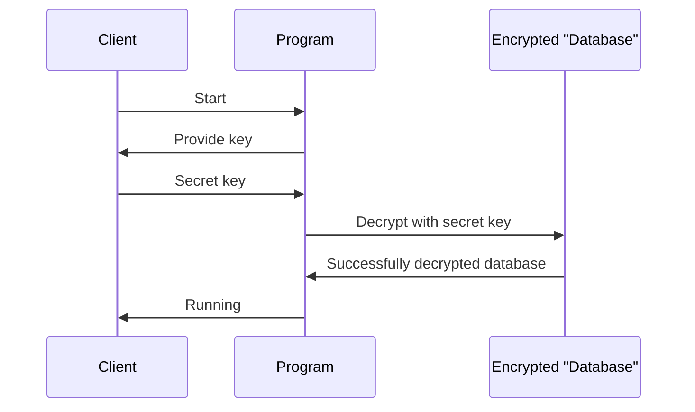
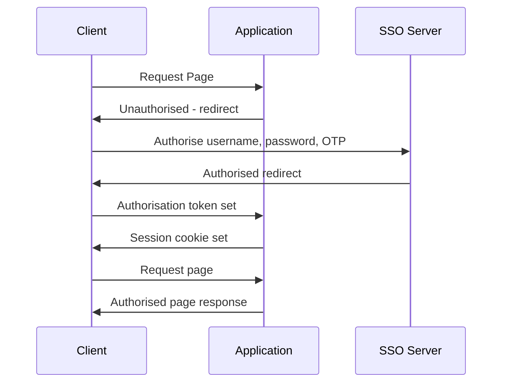
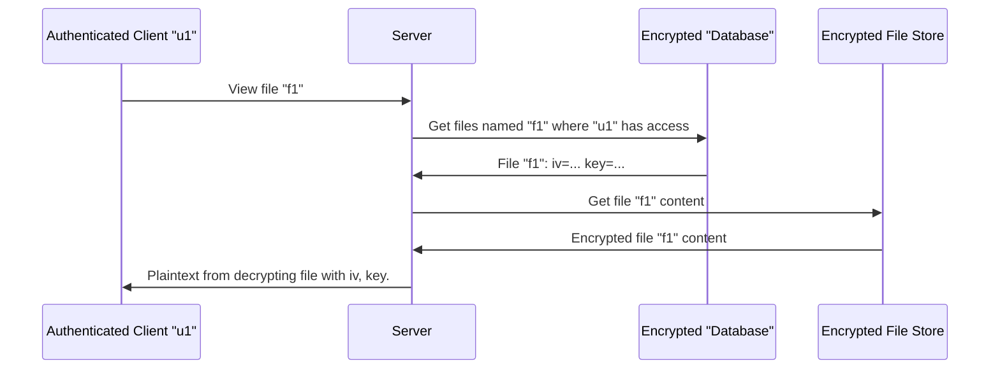

# St John's Hostpital Cryptosystem

## The program

The login secret is: `a-very-long-secret-pls-dont-steal`


### Running:

```bash
$ pip3 install -r requirements.txt
$ python3 run.py
```

This prompts for the secret, then runs the 6 webservers if successful.

To shutdown the webservers, press return.

### Web Addresses:

- sso - https://localhost:1111
- MedRecords - https://localhost:2222
- FinCare - https://localhost:3333
- CareConnect - https://localhost:3355
- Prescriptions - https://localhost:4444
- MediCloud - https://localhost:5555

### Generating one-time passcodes:

Ideally this would be done with OTP applications on phones or computers such as Google authenticator. Whilst this is not possible to submit, the program `gen_otp.py` can generate one-time codes for the SSO system.


## Sequence Diagrams


### Server Initialisation



### SSO



### MediCloud

