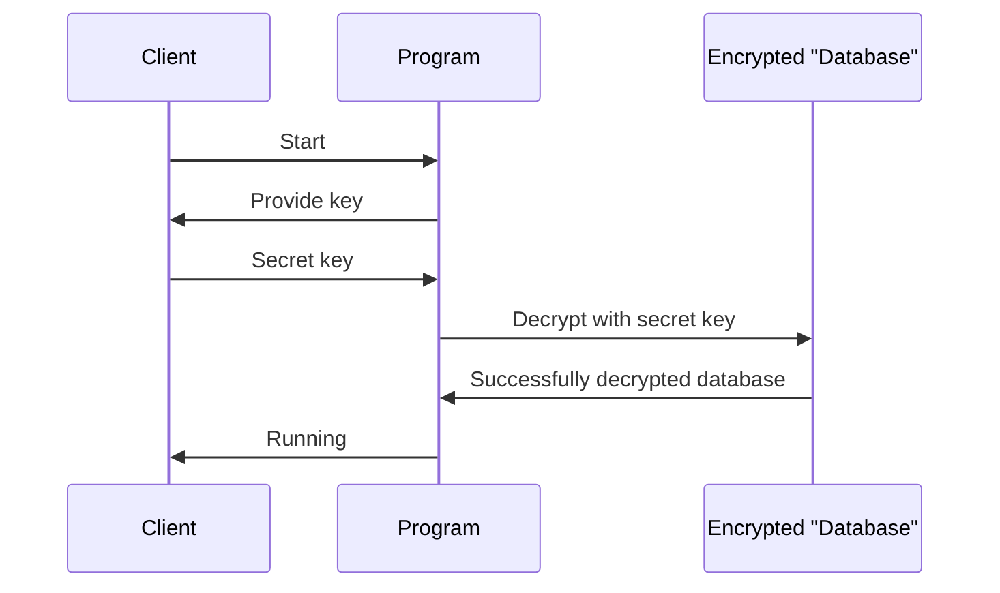
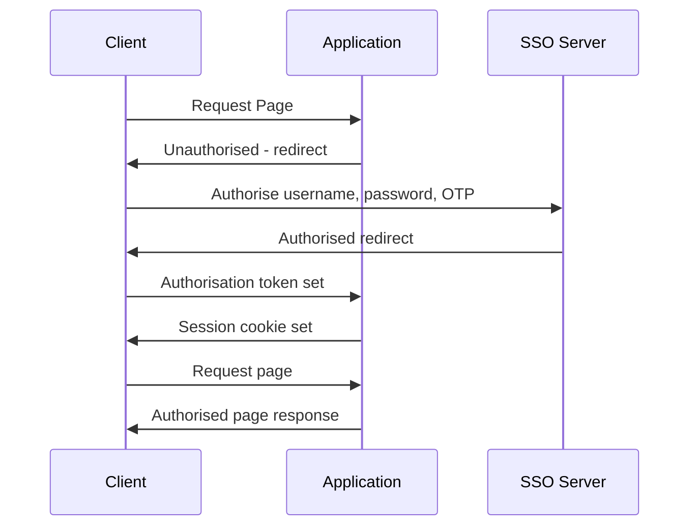
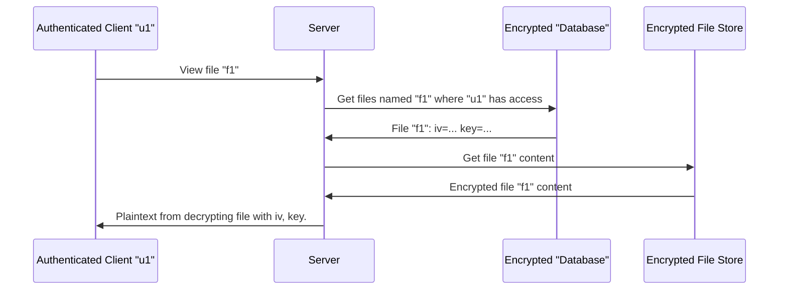

# St John's Hostpital Cryptosystem

## Running

The login secret is: `a-very-long-secret-pls-dont-steal`

```bash

$ pip3 install -r requirements.txt
$ python3 run.py

```


## Sequence Diagrams


### Server Initialisation



### SSO



### MediCloud

